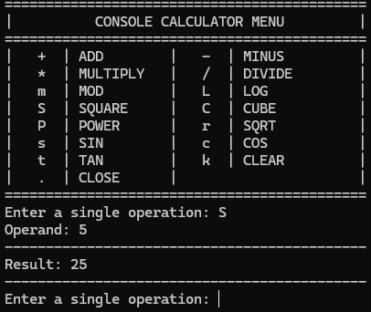

# Console Calculator (C++)
A simple console-based calculator written in **C++** as a learning project.  
It supports basic arithmetic, powers, trigonometric functions, and several scientific operations.  
The program runs in a loop, allowing the user to enter operations until they choose to exit.

---

## How It Works

1. The program displays a calculator menu in the console.
2. The user enters a **single character** representing the desired operation.
3. The program prompts for one or two operands depending on the operation.
4. The calculation is performed and the result is displayed.
5. The loop continues until the user enters `.` to exit.

---

## Example Usage


---

## Requirements
- C++ compiler (GCC, Clang, MSVC, etc.)
- Windows system (uses `system("cls")` to clear the screen)

---

## How to Compile

Using **g++**:

```bash
g++ calculator.cpp -o calculator
